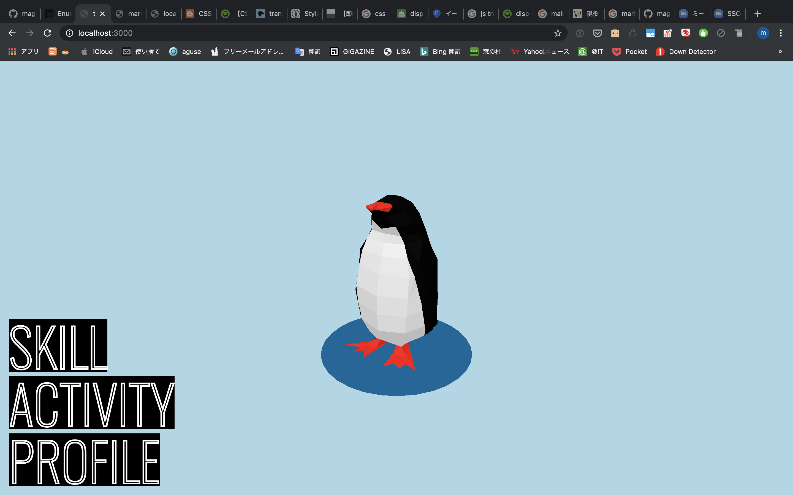

# ポートフォリオ

このwebサイトです。ペンギンイラストの名刺に合わせてデザインしました。

- pug
- stylus
- typescript
- blender

自分用のポートフォリオということで今までアイディアはあったけど使って来なかった演出などをたくさん使っています。中には製作時現在W3C党で草案段階のものもあるのでブラウザ要件がかなり厳しいです。

thre.jsをメインに使ったコンテンツは何度か作ったことがありましたが、今回のように演出として使ったのは初めてです。three.jsの外のコンテンツとの兼ね合いでのタイミング制御（ペンギンが飛び出す等）には悩みました。

webサイトを作るためにまず3Dモデルのアニメーション制作をするというレアケースです。このかわいいペンギンが動く姿を見てもらいたかったので満足です。

